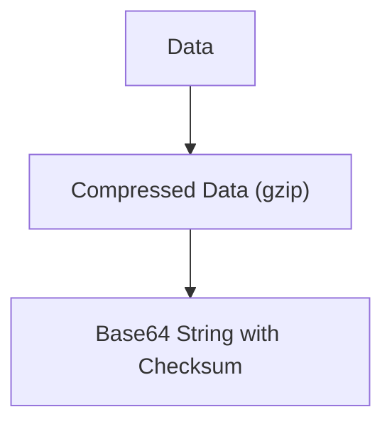
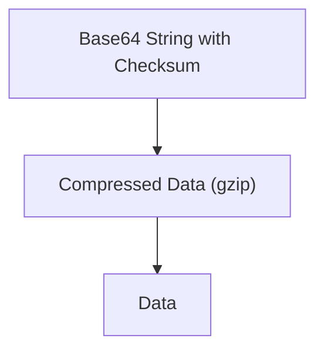

# Files by Clipboard

Transfer files across restrictive environments by using plaintext and the clipboard.

## Overview

To encode, the following process is used:



To decode, the reverse process is used:



All of this processing is done in-browser.

### Encoding from Bash

If you need to encode a file from a remote system via bash, you can run this one-liner:

```sh
fbc () { if [ ! -f "$1" ]; then echo "$1: file not found!"; return; fi; B64="$(gzip -c "$1" | base64 -w0 -)"; echo "$(basename "$1"):$B64:$(echo -n "$B64" | md5sum - | awk '{ print $1; }')"; }; fbc FILENAME
```

This will build up the data that FbC uses with tools often available on *nix systems (it only needs `awk`, `basename`, `gzip` and `md5sum`!).

## Available Scripts

In the project directory, you can run:

### `npm start`

Runs the app in the development mode.\
Open [http://localhost:3000](http://localhost:3000) to view it in the browser.

The page will reload if you make edits.\
You will also see any lint errors in the console.

### `npm run build`

Builds the app for production to the `build` folder.\
It correctly bundles React in production mode and optimizes the build for the best performance.

The build is minified and the filenames include the hashes.\
Your app is ready to be deployed!

See the section about [deployment](https://facebook.github.io/create-react-app/docs/deployment) for more information.
